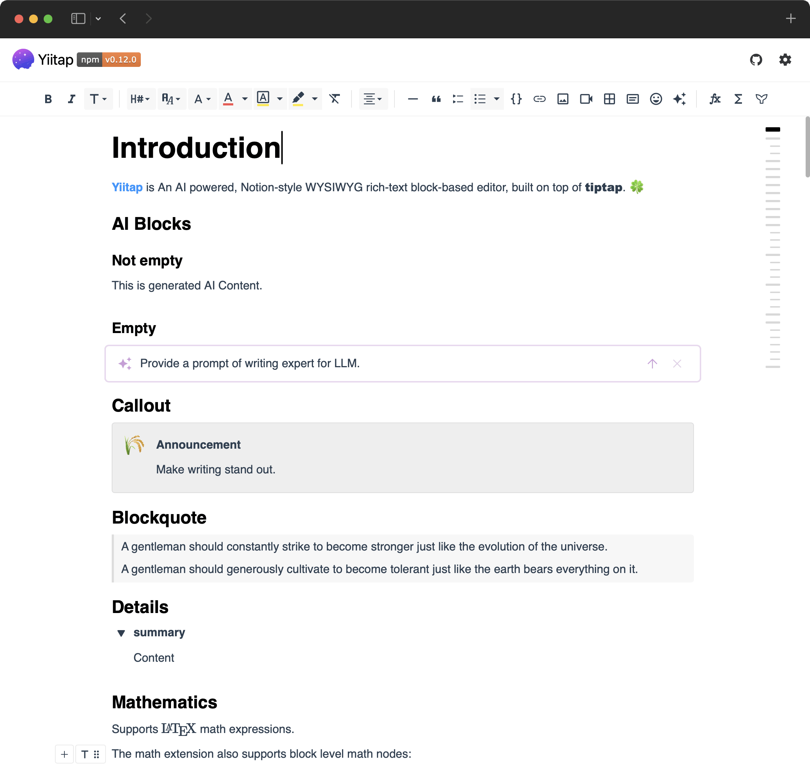

[English](/) | **简体中文**

<h1 align="center">Yiitap</h1>

    
    
    
    
    
    

Yiitap 是一个AI驱动、Notion风格的块级编辑器。🔥

## 特性

🚀 **支持 Vue & React**： 无缝集成两大主流框架  
📝 **Notion 风格编辑器**： 界面简洁，交互直观  
🔧 **高度可定制 & 可扩展**： 基于 **Tiptap** & **ProseMirror** 构建  
🤖 **AI 赋能**： 提供 AI 功能，提升编辑体验  
🧩 **块级编辑**： 通过 **气泡菜单、悬浮菜单、主菜单、侧边菜单** 轻松操作内容  
✨ **丰富的特性**： 内置 **15+ 定制扩展** & **50+ 组件**  
🌍 **国际化** – 支持 **10+ 语言**  
🌗 支持深色模式   
🆓 MIT 许可  

## 快速开始

- [使用指南](https://yiitap.pileax.ai/guide/getting-started)
- [在线演示](https://yiitap.pileax.ai/demo/vue)
- 完整示例: [在线查看](https://pileax-ai.github.io/yiitap/) | [源码](https://github.com/pileax-ai/yiitap/blob/main/apps/vue/src/components/Demo.vue)

如需更详细的信息，请务必查看我们的[文档](https://yiitap.pileax.ai/guide/getting-started)。如果您在使用过程中遇到任何问题或有改进建议，欢迎提交 [issue](https://github.com/pileax-ai/yiitap/issues/new/choose)。

## 截图

## 贡献
如果您希望贡献代码，请参阅我们的[贡献指南](CONTRIBUTING.md)。我们欢迎所有贡献，并将对贡献者给予完整署名。

### 贡献者

## 致谢

- [Tiptap](https://github.com/ueberdosis/tiptap) 与 [ProseMirror](https://github.com/ProseMirror/prosemirror)：Yiitap 构建于 Tiptap 和 ProseMirror 之上。
- [BlockNote](https://github.com/TypeCellOS/BlockNote)：一款基于块结构且可扩展的 React 富文本编辑器。

## 许可证
本项目基于 MIT 许可证发布。更多信息请参阅 [License File](LICENSE)。
